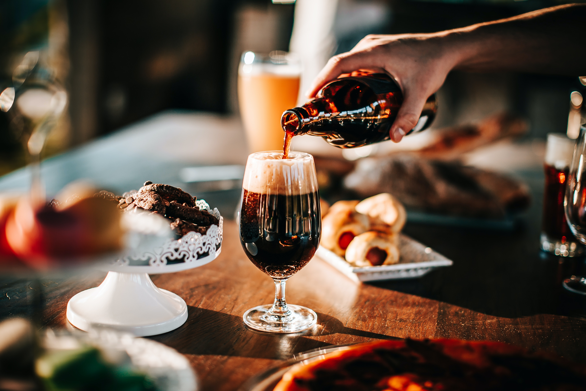
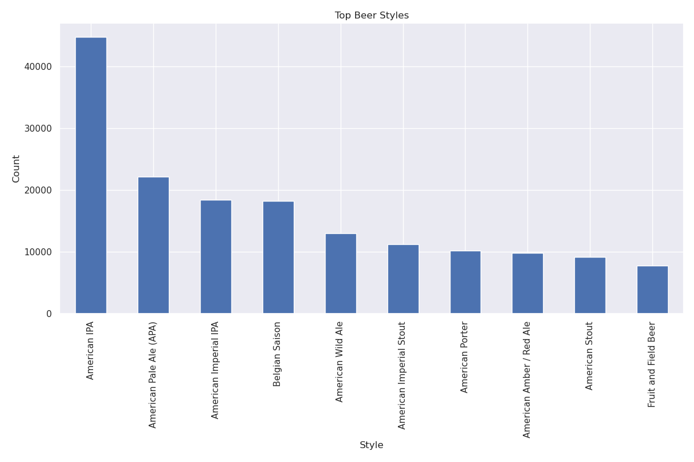
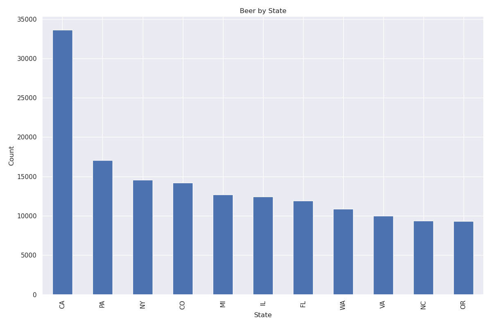
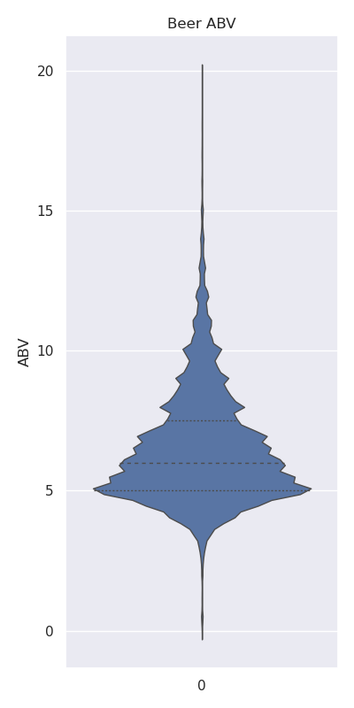
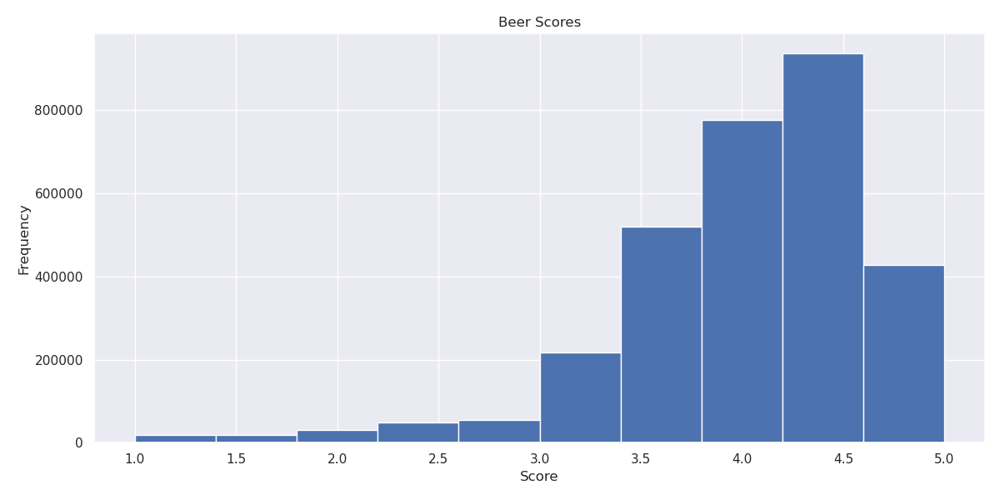
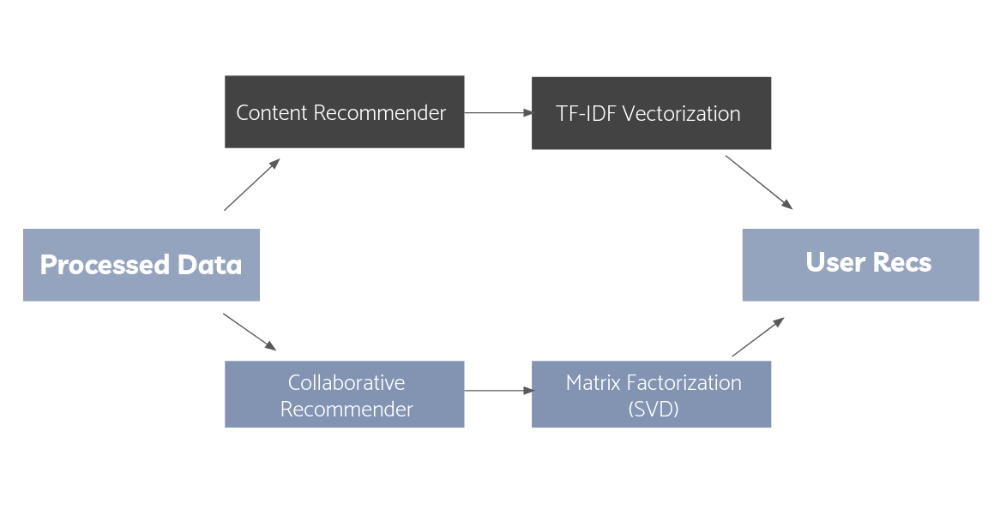
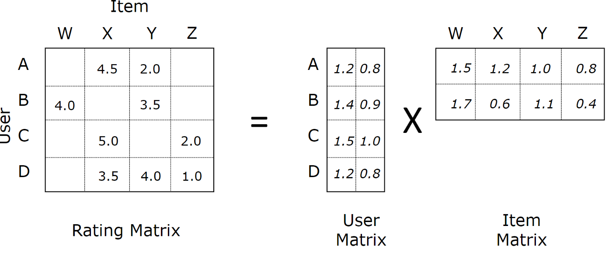
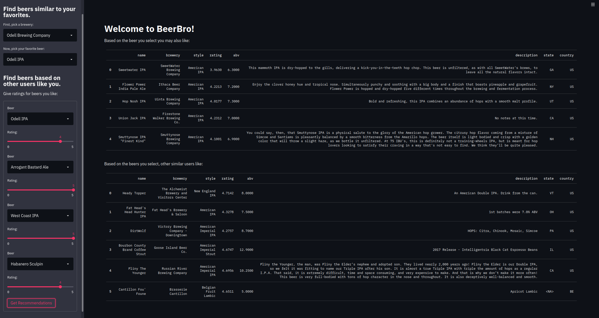

# BeerBro: The app that finds beers you will love!



# Background
I like beer. Who doesn't? There's been countless times I've found myself in the beer isle of a store, wanting to try something new with no idea where to start. I know what beers I've tried, but I can only window shop and usually end up picking a beer based on how cool the label looks. But what if there was some kind of beer recommender I could use that would pick new beers for me?

The goal of this project is just that, build a beer recommender app so I will never again look like a lost and confused shopper in the beer isle.

Introducing the fruits of my labor: **BeerBro**. The BeerBro app combines a content-based natural language processing  with the following results with a collaborative matrix factorization  with the following results to produce both precise and seridipitous beer recommendations based on a user's preferences.

# Data
To train my  with the following results, I used review data from [ratebeer.com](https://www.ratebeer.com/). The dataset was obtained from [Kaggle](https://www.kaggle.com/ehallmar/beers-breweries-and-beer-reviews?select=beers.csv), and contains more than 9 million reviews on more than 250,000 unique beers.

Each review contains scores for the look,smell,taste, feel, and overall score of each beer. Additionaly, many reviews include a text field which may contain tasting notes or an overall impression of the beer. Also included in the data are descriptions of each beer with features including: style, availability, abv, a text description of the label, the brewery that produced the beer, and its state and/or country.

## Beer Data
Taking a look at the beer data, there are more than 112 unique styles of beer in the dataset. 


<table>
  <tr>
    <td>To see their distribution, I plotted the top 10 beer styles by count.</td>
     <td>What states make the most beers?</td>
  </tr>
  <tr>
    <td></td>
    <td></td>
  </tr>
  <tr>
    <td>As you might expect, there are a lot of IPAs. (almost 45,000, making up 17% of the total beers)</td>
  </tr>
 </table>


What's the distribution of alcohol by volume?




## Review Data
If I want to build a collaborative filter, I need to look a the reviews themselves. My first concern is if my review-item matrix is dense enough to use a  with the following results-based approach for generating reccomendations. As I expected, given that I have more than 9 million reviews and only about 165,000 users and 300,000 beers, my matrix was very sparse with a density less than 1/200%.

```
Number of unique users: 164936
Number of unique beers: 309542
Number of ratings: 9073128

The density is: 0.00018
``` 

To solve this issue, I decided to filter my data by only selecting the top 1000 beers with the most reviews. This yielded a density of 2.5%, which although not ideal, I could work with.
```
Number of unique users: 122712
Number of unique beers: 1000
Number of ratings: 3078488
The density is: 0.02509
```

After filtering my data, I took a look at the distribution of reviews to discover most beers are rated highly with a mean score of 4.01 and std 1.32.




By filtering the data, I also was able to collect abundant text reviews for each of the 1000 beers. This would prove to be helpful for my content-based  with the following results.

# Recommender System



## Content Recommender

The content recommender relies on NLP to featurize the text content of the user reviews to find the most similar beers to a user's input. I created a matrix of TF-IDF features using Sklearn's text vectorizer, which I used to compute the cosine similarties between each beer. For each document, I selected to 10,000 highest weighted unigram and bigram words for each document. The resulting item-item similarity matrix is saved to produce future recommendations on the fly.

TF-IDF is a measure of how original a word in a document is by comparing the number of times that word occurs in the doccument with the number of documents having that word. It gives a weight to each word not only by its frequency but its frequency in comparison to all documents, which makes words unique to a document have higher weights than others.

I considered including additional features such as ABV, style, and brewery location with higher weight, however after looking at the text descriptions in addition to the recommendations, the text features appeared to capture these features. The recommendations it produced appeared to be both similar in ABV and style. 

## Collaborative Recommender

Because I was dealing with a large (more than 100,000 users and 1000 beers) and sparse (less than 3% density) user-item matrix, I decided to use matrix-factorization to decompose the sparse matrix into user and item utility matrices containing latent features.



Matrix factorization works by decomposing the user-item matrix into two lower dimensional matrices. The first matrix has a row for each user, while the second has a column for each beer. The corresponding columns and rows of each matrix respectively, represent the latent factors. These factors, although having no real representation in the data, can represent hidden features of data that otherwise couldn't be found by inpsection. One significant advantage of this, is that the model can give more serendipitous recommendations (or recommendations the user would not expect but still enjoy). Additionaly, reconstructing the orginal matrix by finding the product of the two matrices fills in the missing ratings, producing predictions for each user on all items.

To find the best matrix factorization based  with the following results, used cross validation to compute the root-mean-square error of the known ratings. I compared RMSE of the ScikitLearn Surprise package's NMF and SVD models, and Spark's ALS model with the following results:

```
Normal Predictor: 0.889
SVD: 0.436
NMF: 0.463
Spark ALS: 0.467
```
I used Surprise's Normal Predictor as my baseline. The normal predictor algorithm predicts a random rating based on the distribution of the training set, which is assumed to be normal.
After cross-validation, I decided to use Surprise's SVD model as my collaborative filter model.

I then used Grid-Search to optimize the hyperparameters of the SVD model. However, I discovered that a majority of the default parameters of the model performed the best with the following:
```
latent factors: 100 
epochs: 20 
learning rate: 0.005
regularization: 0.02
```

To test the model's performance, I calculated the precision and recall of the predictions. True Positives were beers that were recommended with true scores above a threshold of 4/5 stars. False Positives were beers that were recommended but with true scores falling bellow the threshold. False Negatives were the beers above the threshold but not recommeded. Selecting the top 5 beers for each user, and a threshold of 4, I got the following results:

```
Precision: 0.73
Recall: 0.61
```

Decreasing the threshold improved results, but at the drawback of recommending poorly rated beers.

### Cold Start Problem
One issue that plagues collaborative based recommenders is the issue of cold starts. Cold starts are new users or items lacking any reviews. Because these models rely on comparing the active user to other users, this issue needs to be addresed before any recommendations are made.
I solved this issue in two parts:

First, for the user to receive collaborative-based predictions, the user is forced to rate at least four beers of their choosing. This allows the model to build a initial user profile that can be used to compare to other users.

Second, because matrix factorization models require the user to already be within the initial user-item matrix to create predictions, I could not make unique predictions on-the-fly for each new user without retrainig the model each time. To get around this, my model computes a user-user pearson correlation-matrix after filtering users that have rated at least one of the same beers as the new user. The new user is then given the model's top predictions for the most similar users.

# BeerBro App

To build my app, I used the very handy [streamlit package](https://streamlit.io/). Unfortunately, given the size of my dataset, I was only able to host the app localy. Here is an example of how the app looks:



If you wish to run the app localy, you will need to do the following:
1. Download the original dataset from [Kaggle](https://www.kaggle.com/ehallmar/beers-breweries-and-beer-reviews?select=beers.csv)
2. Clean the data using `src/data_pipe.py`
3. Train the models with `src/models.py` (you will need to use the .fit() methods for both models)
4. Run `src/run.py` to build and host the app locally.
